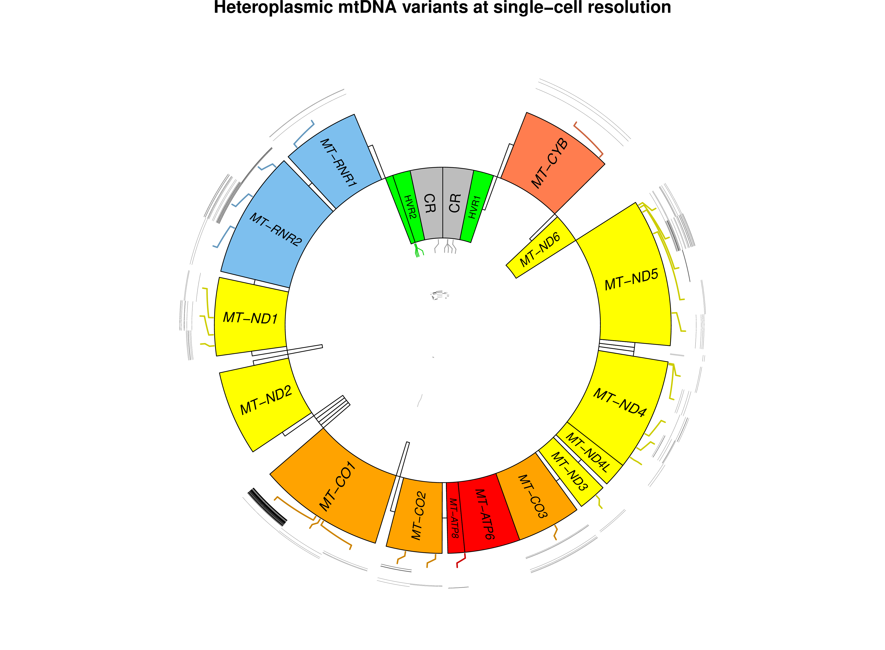

# scMT
single-cell mitochondrial variant calling data


<br />

<br /> 

```r
# recurrently hit regions with counts: 
R> names(mtAnno)[queryHits(findOverlaps(mtAnno, asGR(vars)))] %>% 
     table %>% 
     sort %>% 
     subset(. > 1)
.
 MT-CO2  MT-CO1 MT-RNR2    HVR3  MT-ND1     DLP    HVR1  MT-ND4      CR  MT-ND5 
      2       3       3       4       4       5       5       5       6       6 
```
